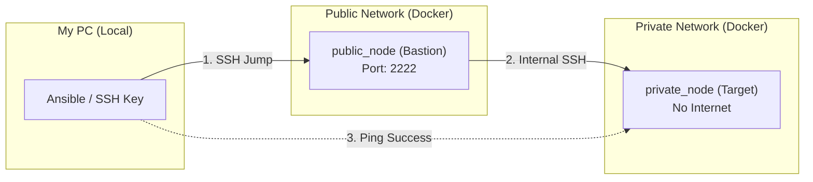

## システム構成図



## サーバー設計パラメーター

| コンテナ名 | 役割 | IPアドレス | SSHポート | 接続ユーザー |
| --- | --- | --- | --- | --- |
| public_node | 踏み台（Bastion） | localhost | 2222 | root |
| private_node | 隔離ターゲット | 172.18.0.2 | 22 | root |

## 構築・実行コマンド

```jsx
# インフラの構築開始
terraform apply -auto-approve

# Ansibleによる接続テスト
ansible-playbook -i inventory.ini ping.yml
```

## Terraformコード（main.tf）

- main.tf
    
    ```jsx
    terraform {
      required_providers {
        docker = {
          source = "kreuzwerker/docker"
          version = "~> 3.0.1"
        }
      }
    }
    
    provider "docker" {}
    
    # --- ネットワークの作成 ---
    # Public NetWork
    resource "docker_network" "public_nw" {
      name = "public_network"
    }
    
    # private NetWork
    resource "docker_network" "private_nw" {
      name = "private_network"
      internal = true # 外部へのルートを持たない設定
    }
    
    # --- コンテナの作成 ---
    # public側に配置するコンテナ（Webなど）
    resource "docker_container" "public_server" {
      name = "public_node"
      image = "ubuntu:22.04"
      entrypoint = [
      "/bin/bash", "-c", 
      "apt update && apt install -y openssh-server && echo 'root:root' | chpasswd && sed -i 's/#PermitRootLogin prohibit-password/PermitRootLogin yes/' /etc/ssh/sshd_config && service ssh start && tail -f /dev/null"
    ]
      
      # １つ目のNW：Public
      networks_advanced {
        name = docker_network.public_nw.name
      }
      
      # ２つ目のNW：Private
      networks_advanced {
        name = docker_network.private_nw.name
      }
      ports {
        internal = 80
        external = 8081
      }
    
      # SSH用の2222
      ports {
        internal = 22
        external = 2222
      }
     } 
    
    # Private側に配置するコンテナ（DBなど）
    resource "docker_container" "private_server" {
      name = "private_node"
      image = "ubuntu:22.04"
      entrypoint = [
      "/bin/bash", "-c", 
      "apt update && apt install -y openssh-server && echo 'root:root' | chpasswd && sed -i 's/#PermitRootLogin prohibit-password/PermitRootLogin yes/' /etc/ssh/sshd_config && service ssh start && tail -f /dev/null"
    ]
    
      # 一時的にこれらを追加
      networks_advanced {
        name = docker_network.public_nw.name
      }
    
      networks_advanced {
        name = docker_network.private_nw.name
      }
    }
    
    ```
    

## Ansible構成（inventory.ini）

- inventory.ini
    
    ```jsx
    [public]
    public_node ansible_host=localhost ansible_port=2222 ansible_user=root
    
    [private]
    private_node ansible_host=172.18.0.2 ansible_user=root
    
    [private:vars]
    ansible_ssh_common_args='-o ProxyCommand="ssh -W %h:%p -q root@localhost -p 2222 -o StrictHostKeyChecking=no -o UserKnownHostsFile=/dev/null"'
    ```
    

## Webサーバー構築（Nginx）

- Playbook.yml  
※この Playbook で `private_node` に Web サーバーを自動インストールします
    
    ```jsx
    - name: Setup Web Server and Custom Page
      hosts: targets
      tasks:
        - name: Install Nginx
          apt:
            name: nginx
            state: present
            update_cache: yes
    
        - name: Copy custom index.html
          copy:
            src: ./index.html
            dest: /var/www/html/index.html
            mode: '0644'
    
        - name: Start Nginx service
          shell: "service nginx start"
    
    ```
    

## Webテストページ（HTML）

- index.html
    
    ```jsx
    <!DOCTYPE html>
    <html>
    <head>
        <meta charset="UTF-8">
        <title>My First IaC</title>
        <style>
            body { width: 35em; margin: 0 auto; font-family: sans-serif; background-color: #f0f8ff; }
            h1 { color: #2e8b57; }
        </style>
    </head>
    <body>
        <h1>Hello, Terraform + Ansible!</h1>
        <p>この画面はAnsibleによって自動的に書き換えられました。</p>
        <p>文字化けも直りましたね！</p>
    </body>
    </html>
    
    ```
    

### 実行結果（疎通確認）

- Ansible Ping 実行ログ
    
    ```jsx
    ~/terraform-docker-test$ ansible all -i inventory.ini -m ping
    public_node | SUCCESS => {
        "ansible_facts": {
            "discovered_interpreter_python": "/usr/bin/python3"
        },
        "changed": false,
        "ping": "pong"
    }
    private_node | SUCCESS => {
        "ansible_facts": {
            "discovered_interpreter_python": "/usr/bin/python3"
        },
        "changed": false,
        "ping": "pong"
    }
     
    ```
    

## 関連ソースコード
